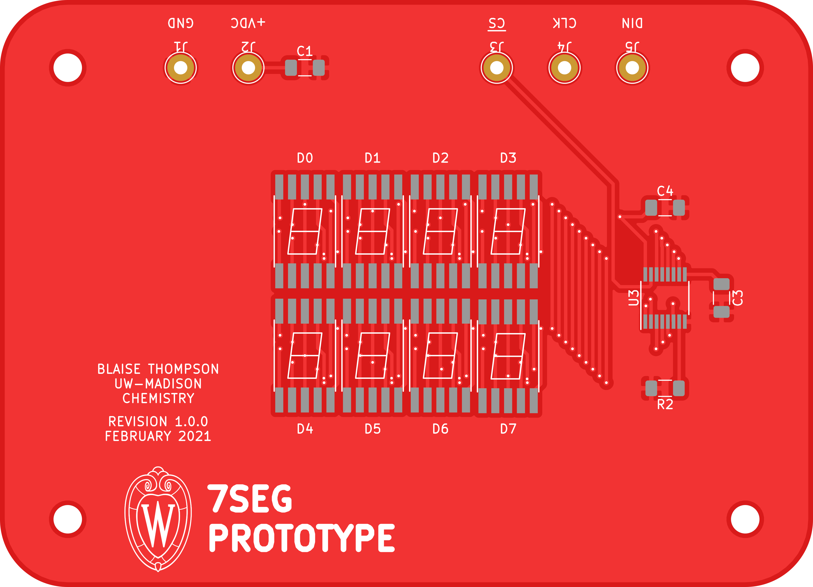
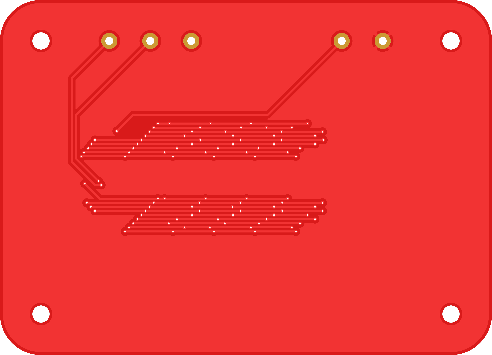

# 7seg-prototype

Prototype board for playing with board-mount 7-segment displays.

## Repository

This is an open source hardware project licensed under the CERN Open Hardware Licence Version 2 - Permissive.
Please see the LICENSE file for the complete license.

This repository is being mirrored to several version control systems in an attempt to ensure maximum avaliability.

| name           | url                                                     |
| -------------- | ------------------------------------------------------- | 
| Chem (primary) | https://git.chem.wisc.edu/shop/7seg-prototype           |
| GitHub         | https://github.com/uw-madison-chem-shops/7seg-prototype | 
| GitLab         | https://gitlab.com/uw-madison-chem-shops/7seg-prototype |

## PCB

This PCB was designed using KiCAD version 5.
Refer to `7seg-prototype.pdf` for schematic.
PCB images generated with [tracespace](https://github.com/tracespace/tracespace) follow.

Bill of Materials

| reference      | value         | manufacturer  | part number          | vendors |
| :------------- | :------------ | :------------ | :------------------- | :------ |
| C1             | 100u, 1206    |               |                      |         |
| C3             | 20 pF         |               |                      |         |
| C4             | 100n, 1206    |               |                      |         |
| D0-D8          | 7seg Chip     | Kingbright    | ACSC08-51SGWA        | [DigiKey](https://www.digikey.com/en/products/detail/kingbright/ACSC02-41SURKWA-F01/2163667) [Newark](https://www.mouser.com/ProductDetail/Kingbright/ACSC02-41SURKWA-F01?qs=%2Fha2pyFaduicALusGN0JMV18ke69tDrFejQJKKPoTyQtUMuwRB9U3sQCvd0zqoH%2F) |
| J1-J5          | Test Point    |               |                      |         |
| R2             | 100k          |               |                      |         |
| U3             | Driver Chip   | Maxim         | MAX6951CEE+          | [DigiKey](https://www.digikey.com/en/products/detail/maxim-integrated/MAX6951CEE-T/5640031) [Newark](https://www.newark.com/maxim-integrated-products/max6951cee/led-driver-smd-8mhz-qsop-16/dp/81Y9572?rpsku=rel1%3AMAX6951CEET) [Mouser](https://www.mouser.com/ProductDetail/?qs=1THa7WoU59G039lytpTsUQ%3D%3D) |

## Changelog

### 1.0.0

#### Added
- initial design

